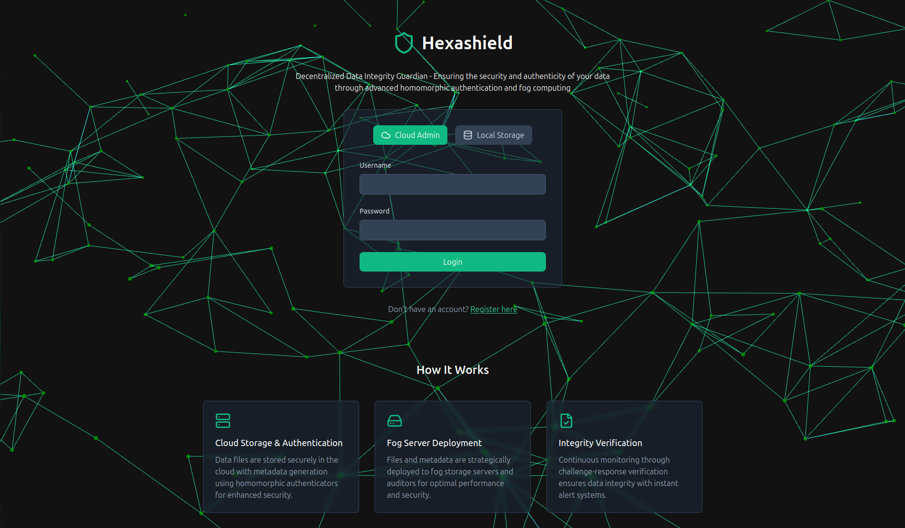

## 🔐 HexaShield – Decentralized Storage with Built-in Data Auditing

HexaShield is a secure, user-friendly platform that ensures file integrity across localized fog infrastructures—without requiring full file access or third-party auditors. Inspired by Filecoin, it enables peer-to-peer auditing using lightweight cryptography and probabilistic checks, built for non-technical users and edge environments.



---

## 🚀 Key Highlights

- Cloud Coordination: Stores files, generates cryptographic metadata, and initiates audits.
- Fog Storage & Auditing: Local edge devices store and verify data in a decentralized model.
- No Full File Required: Audits happen securely without full file retrieval.
- Lightweight & Accurate: Uses 4% sampling to detect 1% corruption with 99% accuracy.
- Real-Time Alerts: Instantly detects and reports unauthorized modifications.
- GUI Dashboard: Simple interface for uploads, verification, and results.

---

## 🛠️ Tech Stack

Frontend:
- React.js – Responsive and intuitive UI.

Backend:
- Node.js – API logic and audit handling.
- Socket.IO – Real-time coordination between nodes.
- MongoDB – Metadata and log storage.

Crypto & Verification:
- Algebraic Signatures – Metadata tagging.
- Zero-Knowledge Proofs – Privacy-preserving verification.
- Diffie-Hellman – Security assumptions.
- Ateniese Sampling – Efficient probabilistic integrity checks.

---

## ✨ Features

🔒 Decentralized File Integrity Verification
- Peer-to-peer auditing by fog nodes without needing full file access.

⚡ Real-Time Challenge-Response Auditing
- Homomorphic authenticators and zero-knowledge protocols enable quick audits and tamper alerts.

📊 User-Friendly Dashboard
- React-based interface with visual feedback designed for all users.

---

## 🚀 How to Run on a Local Network

### 🖥️ System Setup – 3 Machines
- **Cloud PC** – Hosts the backend and database.
- **Alice (Auditor)** – Verifies integrity.
- **Bob (Auditee)** – Stores files.

### 🔁 Step 1: Clone the Repository (All PCs)
```bash
git clone https://github.com/yourusername/HexaShield.git
```

### 🌐 Step 2: Backend & Database Configuration
- Ensure all systems are on the same local Wi-Fi network.
- On **Alice** and **Bob**:
    - Start MongoDB.
    - Start backend server using **Cloud PC’s IP**.

#### Replace all `localhost` references with **Cloud IP** in:
- `.env`
- `Verification.tsx`
- `LocalHome.tsx`

### 📁 Step 3: Cloud PC Configuration
#### Edit `runScript.js`:
- Line 20: Path to `SetupTagGen.sh`
- Line 21 & 46: Path to `15MBData.csv`
- Line 71 & 102: Path to `Admin-Cloud` folder
- Line 47 & 103: Output path for Bob's file (`Bob.sh`)
- Line 72: Path to `Auditor` folder

#### Edit `SetupTagGen.sh`:
- Replace all `dataaudit` paths with your correct local path

### 📁 Step 4: Alice & Bob Configuration

#### Alice (Auditor):
- `runScript.js`: Update line 132 & 194 with your local file path
- `alice.sh`:
    - Set path to `dataaudit` folder
    - Set **Bob’s IP address**

#### Bob (Auditee):
- `runScript.js`: Update line 132 & 194 with your local file path
- `bob.sh`:
    - Set path to `dataaudit` folder
    - Set **Alice’s IP address**

### 🔐 Step 5: Network Permissions (All PCs)
```bash
chmod -R +x Demo/
sudo ufw allow 22224
sudo ufw allow 22223
```

### 🖥️ Step 6: Start Backend and Frontend (All PCs)
```bash
# Terminal 1
cd backend
npm install
npm start

# Terminal 2
cd frontend
npm install
npm run dev
```

### ✅ Step 7: Workflow Execution

1. **Register Users**
    - Cloud PC: Register as `cloud`
    - Alice & Bob: Register as `local`

2. **Cloud PC**
    - Upload a file and generate metadata
    - Send file to **Bob PC**
    - Distribute verification data to **Alice PC** and **Bob PC**
    - Click **Send Verification**

3. **Bob PC**
    - Run `bob.sh` to start process
    - Sends message to **Alice**

4. **Alice PC**
    - Run `alice.sh` to start auditing
    - Results auto-sent to Cloud and visible in dashboard

---

✅ **You’re All Set!**
You’ve successfully deployed HexaShield – a secure, decentralized, and real-time file integrity verification system across your local network.

---

📌 For more details, reach out or open an issue in the repository!
